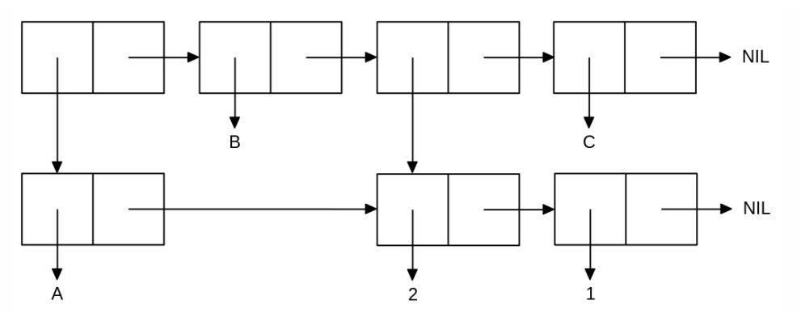

<p align="center"><b>МОНУ НТУУ КПІ ім. Ігоря Сікорського ФПМ СПіСКС</b></p>
<p align="center">
<b>Звіт з лабораторної роботи 1</b><br/>
"Обробка списків з використанням базових функцій"<br/>
дисципліни "Вступ до функціонального програмування"
</p>
<p align="right">Студент: Парієнко Віктор Володимирович КВ-11<p>
<p align="right">Рік: 2024<p>


## Загальне завдання
1. Створіть список з п'яти елементів, використовуючи функції LIST CONS . Форма створення списку має бути одна — використання SET чи SETQ (або інших допоміжних форм) для збереження проміжних значень не допускається. Загальна кількість елементів (включно з підсписками та їх елементами) не має перевищувати 10-12 шт. (дуже великий список робити не потрібно). Збережіть створений список у якусь змінну з SET або SETQ . Список має містити (напряму або у підсписках):

* хоча б один символ
* хоча б одне число
* хоча б один не пустий підсписок
* хоча б один пустий підсписок

2. Отримайте голову списку.
3. Отримайте хвіст списку.
4. Отримайте третій елемент списку.
5. Отримайте останній елемент списку.
6. Використайте предикати ATOM та LISP на різних елементах списку (по 2-3 приклади для кожної функції).
7. Використайте на елементах списку 2-3 інших предикати з розглянутих у розділі 4 навчального посібника.
8. Об'єднайте створений список з одним із його непустих підсписків. Для цього використайте функції APPEND.


```lisp
;; Пункт 1
(defvar result nil)
(set 'result (cons 'head (list (list 'a (list 2 'b) ) nil 3 'tale )))

;;(HEAD (A (2 B)) NIL 3 TALE)

;; Пункт 2
(car result)
;;HEAD

;; Пункт 3
(cdr result)
;;((A (2 B)) NIL 3 TALE)

;; Пункт 4
(car (cdr (cdr result))) 
;;NIL

;; Пункт 5
(car (last result))
;;TALE

;; Пункт 6
(atom (car result)) 
;;T
(atom (car (cdr result)))       
;;NIL
(atom (nth 2 result)))) 
;;T
(listp (car (last result)))
;;NIL
(listp (car result))
;;NIL
(listp (car (cdr result)))
;;T

;; Пункт 7
(eql (car result) 'head)
;;T

(minusp (nth 3 result))  
;;NIL

(equalp (cdr (car (cdr result))) '((2 b)))
;;T

;; Пункт 8
(append result (car (cdr result))) 
;;(HEAD (A (2 B)) NIL 3 TALE A (2 B))
```
## Варіант 18 (2)
<p align="center">

</p>

```lisp
(defvar list21 nil)
(defvar final-list nil)
(setq list21 '(2 1) 
    final-list (cons (cons 'a list21) 
        (list 'b  list21 'c)))
final-list
;;((A 2 1) B (2 1) C)
```
